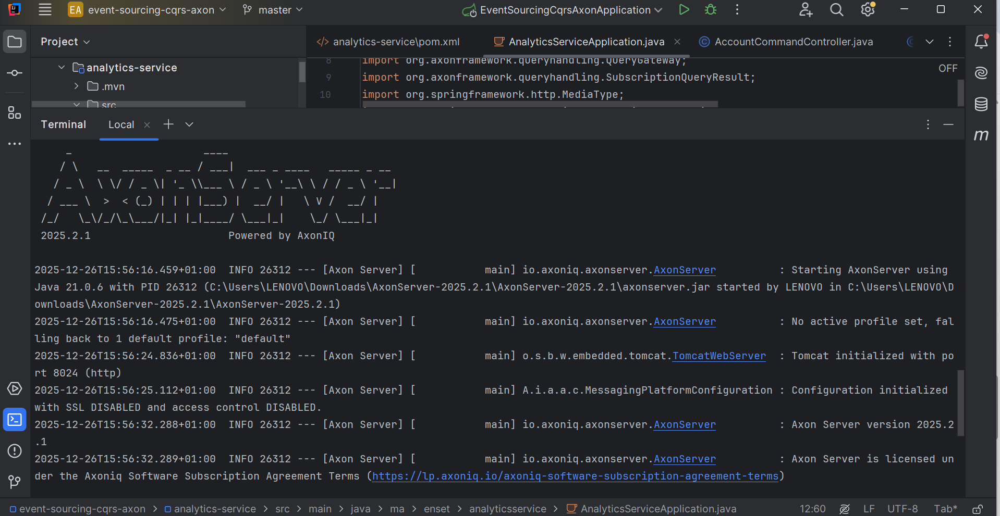
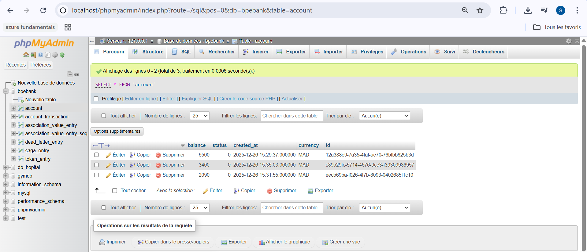
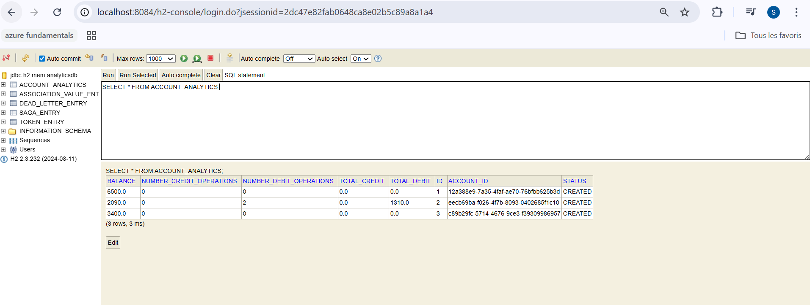
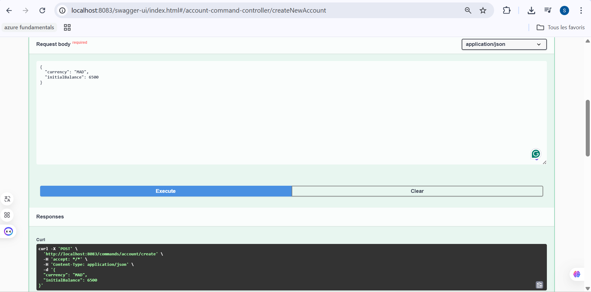
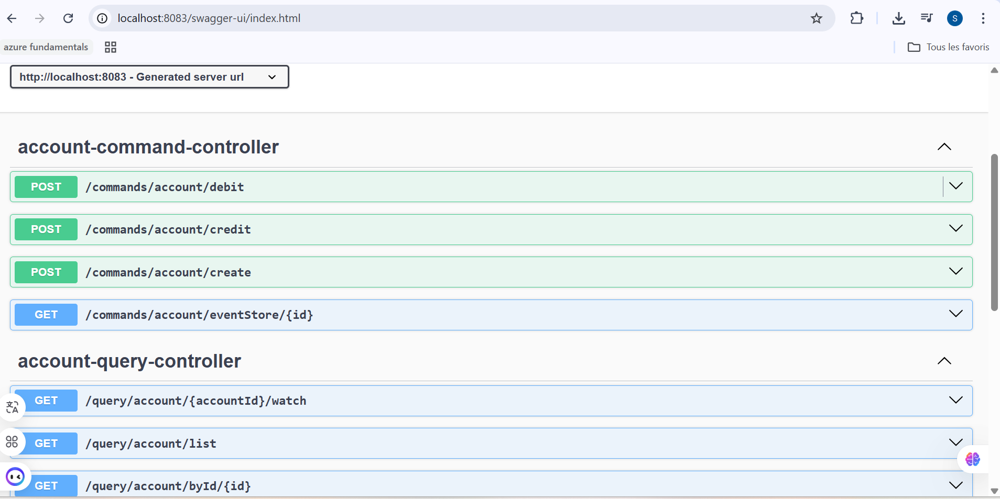
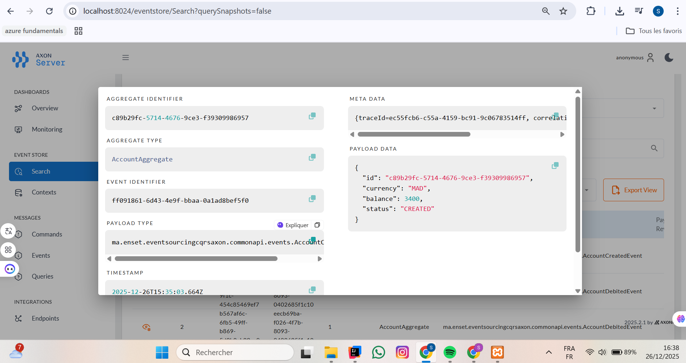
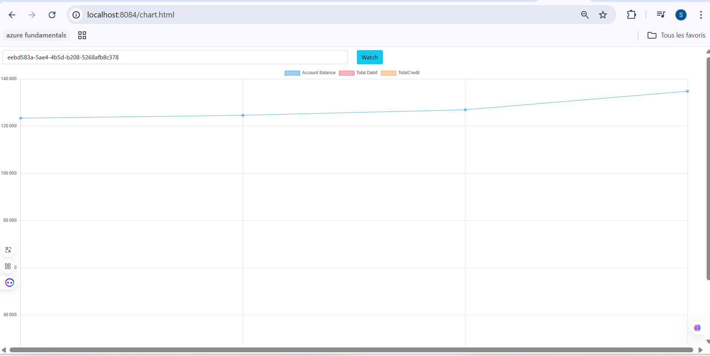

# Event Sourcing Bank Account - Axon Framework

Application bancaire utilisant l'architecture **CQRS** (Command Query Responsibility Segregation) et **Event Sourcing** avec **Axon Framework**.

##  Description

Cette application démontre l'implémentation d'un système de gestion de comptes bancaires avec:
-  Création de comptes
-  Opérations de crédit et débit
-  Consultation en temps réel des soldes
-  Historique complet des événements
-  Service d'analytics avec métriques temps réel

## ️ Architecture

### Pattern CQRS + Event Sourcing

L'application utilise une architecture microservices séparant la gestion des commandes (écriture) et des requêtes (lecture) avec stockage des événements.

### Microservices

Le projet est composé de **2 microservices** :

#### 1. **Command & Query Service** (`event-sourcing-cqrs-axon`)
Service principal qui gère les commandes et requêtes bancaires.

**Port**: `8081`

#### 2. **Analytics Service** (`analytics-service`)
Service d'analyse qui consomme les événements pour calculer des statistiques.

**Port**: `8082`

### Composants Principaux

#### 1. **Command Side** (Écriture) - Port 8081
- **Commands**: Actions à exécuter
    - `CreateAccountCommand`: Créer un nouveau compte
    - `CreditAccountCommand`: Créditer un compte
    - `DebitAccountCommand`: Débiter un compte

- **Aggregate**: `AccountAggregate`
    - Gère la logique métier
    - Valide les commandes
    - Produit des événements

#### 2. **Events** (Communication entre microservices)
Les événements sont partagés via le package `commonapi` :
- `AccountCreatedEvent`: Compte créé
- `AccountCreditedEvent`: Compte crédité
- `AccountDebitedEvent`: Compte débité

#### 3. **Query Side** (Lecture) - Port 8081
- **Queries**: Requêtes de consultation
    - `GetAllAccounts`: Liste tous les comptes
    - `GetAccountById`: Détails d'un compte

- **Event Handlers**: Mise à jour de la base de données de lecture
- **Entities**: `Account`, `AccountTransaction`

#### 4. **Analytics Side** (Analyse) - Port 8082
- **Event Handlers**: Écoute les événements du service principal
- **Queries**:
    - `GetAllAccountAnalytics`: Liste toutes les analytics
    - `GetAccountAnalyticsByAccountId`: Analytics d'un compte spécifique
- **Entity**: `AccountAnalytics`
    - Balance (solde actuel)
    - Total Credit/Debit
    - Nombre d'opérations

##  Technologies

- **Java 21**
- **Spring Boot 3.4.2** (Service principal)
- **Spring Boot 3.4.2** (Service Analytics)
- **Axon Framework 4.10.3** - CQRS & Event Sourcing
- **MySQL** - Base de données du service principal
- **H2** - Base de données du service Analytics (en mémoire)
- **Spring Data JPA** - Persistence
- **Lombok** - Réduction du boilerplate
- **SpringDoc OpenAPI** - Documentation API (Swagger)

##  Démarrage

### Prérequis

1.  **Java 21** installé
2.  **MySQL** en cours d'exécution (pour le service principal)
3.  **Maven** installé

### Configuration

#### Option 1: Avec Axon Server (Production)

Si vous souhaitez utiliser Axon Server pour la communication entre microservices :

1. **Télécharger Axon Server**:
```bash
# Télécharger depuis
https://download.axoniq.io/axonserver/AxonServer.zip

# Extraire et lancer
cd axonserver
java -jar axonserver.jar
```

Axon Server sera accessible sur: **http://localhost:8024**


### Créer la base de données MySQL


### Lancer les applications

**Terminal 1 - Service Principal**:
```bash
cd event-sourcing-cqrs-axon
mvn spring-boot:run
```

**Terminal 2 - Service Analytics**:
```bash
cd analytics-service
mvn spring-boot:run
```

Les applications démarrent sur:
- **Service Principal**: http://localhost:8081
- **Service Analytics**: http://localhost:8082
- **H2 Console** (Analytics): http://localhost:8082/h2-console
  


##  API Documentation

### Swagger UI

#### Service Principal (Commands & Queries)
**URL**: http://localhost:8081/swagger-ui.html

#### Service Analytics
**URL**: http://localhost:8082/swagger-ui.html

### Endpoints disponibles

#### **Service Principal** - Port 8081

**Commands** (Écriture):
```http
POST /commands/account/create
POST /commands/account/credit
POST /commands/account/debit
```

**Queries** (Lecture):
```http
GET /query/accounts
GET /query/accounts/{accountId}
```

#### **Service Analytics** - Port 8082

**Queries** (Analytics):
```http
GET /query/accountAnalytics
GET /query/accountAnalytics/{accountId}
```

###  Exemple d'utilisation

#### 1. Créer un compte (Service Principal)
```http
POST http://localhost:8081/commands/account/create
Content-Type: application/json

{
  "initialBalance": 1000.0,
  "currency": "MAD"
}
```

**Réponse**:
```json
{
  "id": "abc-123-def",
  "status": "CREATED"
}
```

#### 2. Créditer le compte (Service Principal)
```http
POST http://localhost:8081/commands/account/credit
Content-Type: application/json

{
  "accountId": "abc-123-def",
  "amount": 500.0,
  "currency": "MAD"
}
```

#### 3. Consulter le compte (Service Principal)
```http
GET http://localhost:8081/query/accounts/abc-123-def
```

**Réponse**:
```json
{
  "id": "abc-123-def",
  "balance": 1500.0,
  "status": "ACTIVATED",
  "currency": "MAD"
}
```



#### Visualiser les événements



#### 4. Consulter les analytics (Service Analytics)
```http
GET http://localhost:8082/query/accountAnalytics/abc-123-def
```

**Réponse**:
```json
{
  "accountId": "abc-123-def",
  "balance": 1500.0,
  "totalCredit": 500.0,
  "totalDebit": 0.0,
  "numberCreditOperations": 1,
  "numberDebitOperations": 0,
  "status": "ACTIVATED"
}
```

##  Service Analytics

Le service Analytics est un microservice indépendant qui consomme les événements pour calculer et afficher des statistiques en temps réel.

### Architecture du Service Analytics

Le service illustre le pattern **Event-Driven Architecture** et **Microservices**:
-  Service autonome avec sa propre base de données (H2)
-  Écoute les événements publiés par le service principal
-  Calcule des métriques agrégées en temps réel
-  Expose des APIs de consultation

### Métriques Calculées

Pour chaque compte, le service calcule automatiquement:
- **Balance**: Solde actuel du compte
- **Total Debit**: Somme de tous les débits
- **Total Credit**: Somme de tous les crédits
- **Number of Debit Operations**: Nombre d'opérations de débit
- **Number of Credit Operations**: Nombre d'opérations de crédit

### Comment ça fonctionne ?

1. **Création de compte**:
    - Le service principal émet un `AccountCreatedEvent`
    - Le service Analytics le capture et initialise les statistiques

2. **Opération de crédit**:
    - Le service principal émet un `AccountCreditedEvent`
    - Le service Analytics met à jour : `totalCredit++`, `numberCreditOperations++`, `balance += amount`

3. **Opération de débit**:
    - Le service principal émet un `AccountDebitedEvent`
    - Le service Analytics met à jour : `totalDebit++`, `numberDebitOperations++`, `balance -= amount`

## Interface de Visualisation
Le service inclut une interface web pour visualiser les analytics en temps réel avec des graphiques dynamiques.

URL: http://localhost:8084/chart.html

# Utilisation de l'interface:
Ouvrez http://localhost:8084/chart.html dans votre navigateur
Entrez l'ID d'un compte dans le champ
Cliquez sur "Watch"
Les graphiques se mettent à jour automatiquement à chaque opération (crédit/débit)



## Structure du projet

```
event-sourcing-cqrs-axon/                    # Service Principal (Port 8081)
├── src/main/java/ma/enset/eventsourcingcqrsaxon/
│   ├── commands/
│   │   ├── aggregates/
│   │   │   └── AccountAggregate.java        # Logique métier
│   │   └── controllers/
│   │       └── AccountCommandController.java
│   ├── commonapi/                            # ⚡ Partagé entre microservices
│   │   ├── commands/                         # Commandes
│   │   ├── events/                           # Événements
│   │   ├── dtos/                             # DTOs
│   │   ├── enums/                            # Énumérations
│   │   └── exceptions/                       # Exceptions métier
│   └── query/
│       ├── controllers/
│       │   └── AccountQueryController.java
│       ├── entities/                         # Entités JPA
│       ├── repository/                       # Repositories
│       └── services/
│           └── AccountEventHandlerService.java
└── pom.xml

analytics-service/                            # Service Analytics (Port 8082)
├── src/main/java/ma/enset/analyticsservice/
│   ├── entities/
│   │   └── AccountAnalytics.java            # Entité Analytics
│   ├── queries/
│   │   ├── GetAllAccountAnalytics.java
│   │   └── GetAccountAnalyticsByAccountId.java
│   ├── repo/
│   │   └── AccountAnalyticsRepo.java
│   ├── service/
│   │   └── AccountAnalyticsEventHandler.java # Consommation événements
│   └── AnalyticsServiceApplication.java
└── pom.xml
```

##  Concepts clés

### Event Sourcing
Au lieu de stocker l'état actuel, on stocke **tous les événements** qui ont modifié l'état. L'état actuel est reconstruit en rejouant les événements.

**Avantages**:
-  Historique complet et audit trail
-  Possibilité de reconstruire l'état à n'importe quel moment
-  Debug facilité
-  Analytics en temps réel via la consommation d'événements

### CQRS
Séparation entre les modèles d'écriture (Commands) et de lecture (Queries).

**Avantages**:
-  Scalabilité indépendante
-  Optimisation séparée
-  Modèles adaptés aux besoins
-  Possibilité d'ajouter des microservices d'analyse

### Aggregate
Unité de cohérence qui protège les invariants métier. Dans ce projet, `AccountAggregate` s'assure que:
-  Le solde initial n'est pas négatif
-  Les montants sont positifs
-  Le solde est suffisant pour les débits

### Microservices Event-Driven
Architecture où les services communiquent via des événements:
-  Couplage faible entre services
-  Évolutivité facile (ajout de nouveaux services)
-  Résilience (un service peut tomber sans affecter les autres)

##  Dépendances entre microservices

Le service Analytics dépend du service principal via le package `commonapi` :

```xml
<!-- Dans analytics-service/pom.xml -->
<dependency>
   <groupId>ma.enset</groupId>
   <artifactId>event-sourcing-cqrs-axon</artifactId>
   <version>0.0.1-SNAPSHOT</version>
</dependency>
```

Cela permet d'importer les événements :
```java
import ma.enset.eventsourcingcqrsaxon.commonapi.events.AccountCreatedEvent;
import ma.enset.eventsourcingcqrsaxon.commonapi.events.AccountCreditedEvent;
import ma.enset.eventsourcingcqrsaxon.commonapi.events.AccountDebitedEvent;
```


